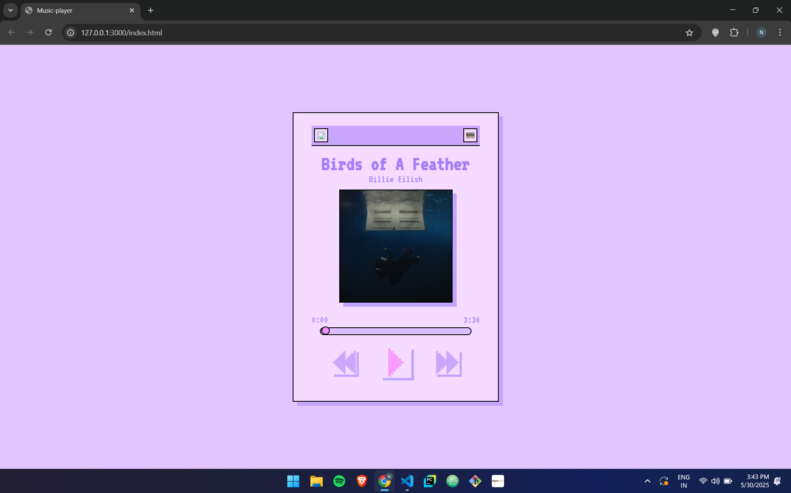

# 🎵 Retro-Inspired Music Player 🎶

A beautifully styled, responsive music player built with HTML, CSS, and JavaScript. Inspired by retro aesthetics with pixel fonts, soft pastels, and a clean UI — this project lets users play, pause, and seek through a single track.

---

## 📸 Preview

  

---

## 🚀 Features

- 🎧 Play & Pause functionality  
- 📍 Seek through track using a custom progress bar  
- 🎨 Retro UI with pixel-style typography  
- 📱 Fully responsive design for mobile and tablet  
- 🔊 Smooth interaction with JavaScript-based controls  

---

## 🛠️ Tech Stack

- **HTML5**
- **CSS3** (custom box-shadows, gradients, and responsive styling)
- **JavaScript** (for audio functionality and interactivity)
- **Google Fonts:** VT323
